# Medallion Pipeline Flow - Jobs, Tables, and Transformations

## Complete Data Pipeline Flow

```mermaid
graph TD
    %% User Upload
    A[CSV Upload S3] --> B[Airflow DAG Trigger]
    
    %% Bronze Layer
    B --> C["Job 1: Bronze Ingestion<br/>Input: Transaction CSVs + Settlement CSVs + Aurora CDC<br/>Transform: Raw Copy + Metadata + Deduplication<br/>Output: RAW_TRANSACTIONS, RAW_SETTLEMENTS, RAW_DIMENSIONS"]
    C --> D[(RAW_TRANSACTIONS<br/>RAW_SETTLEMENTS<br/>RAW_DIM_CUSTOMERS<br/>RAW_DIM_ACCOUNTS<br/>RAW_DIM_VENDORS<br/>RAW_DIM_CATEGORIES<br/>RAW_DIM_SETTLEMENT_METHODS)]
    
    %% Silver Layer - Validation
    D --> E["Job 2: Silver Validation<br/>Input: RAW_TRANSACTIONS, RAW_DIMENSIONS<br/>Transform: Data Quality + Type Casting + Deduplication<br/>Output: silver.transactions_cleaned, silver.dimensions_cleaned"]
    E --> F[(silver.transactions_cleaned<br/>silver.dimensions_cleaned)]
    
    %% Silver Layer - Normalization  
    F --> G["Job 3: Silver Normalization<br/>Input: silver.transactions_cleaned, silver.dimensions_cleaned<br/>Transform: JSON Parsing + Allocation Logic + SCD Type 2<br/>Output: silver.allocations_normalized, silver.dimensions_scd"]
    G --> H[(silver.allocations_normalized<br/>silver.dimensions_scd)]
    
    %% Aurora CDC Stream
    I[(Aurora CDC Stream<br/>DMS/Kinesis<br/>→ S3 Raw Bucket)] --> C
    
    %% Snowflake Import
    H --> J["Job 4: Snowflake Import<br/>Input: silver.transactions_cleaned, silver.allocations_normalized, silver.dimensions_scd<br/>Transform: S3 to Snowflake Import<br/>Output: Snowflake SILVER tables"]
    J --> K[(Snowflake SILVER<br/>SILVER_TRANSACTIONS<br/>SILVER_ALLOCATIONS<br/>SILVER_DIM_CUSTOMERS<br/>SILVER_DIM_ACCOUNTS<br/>SILVER_DIM_VENDORS<br/>SILVER_DIM_CATEGORIES<br/>SILVER_DIM_SETTLEMENT_METHODS)]
    
    %% dbt Gold Transformation
    K --> L["Job 5: dbt Gold Transformation<br/>Input: Snowflake SILVER + DIMENSIONS<br/>Transform: Silver to Gold + Dimension Joins + SCD Type 2<br/>Output: Snowflake GOLD Fact Tables"]
    L --> M[(Snowflake GOLD<br/>FACT_TRANSACTIONS<br/>FACT_EXPENSE_ALLOCATIONS<br/>FACT_SETTLEMENTS<br/>FACT_LEDGER)]
    
    %% Monitoring
    D --> P["Job 6: Data Quality Monitoring<br/>Input: All Bronze, Silver, Gold tables<br/>Transform: Quality Metrics + Lineage<br/>Output: monitoring.data_quality_metrics, monitoring.job_lineage"]
    F --> P
    H --> P
    M --> P
    P --> Q[(monitoring.data_quality_metrics<br/>monitoring.job_lineage)]
    
    %% Styling
    classDef bronzeLayer fill:#CD7F32,stroke:#8B4513,stroke-width:2px,color:#fff
    classDef silverLayer fill:#C0C0C0,stroke:#808080,stroke-width:2px,color:#000
    classDef goldLayer fill:#FFD700,stroke:#DAA520,stroke-width:2px,color:#000
    classDef exportLayer fill:#4169E1,stroke:#191970,stroke-width:2px,color:#fff
    classDef analyticsLayer fill:#32CD32,stroke:#228B22,stroke-width:2px,color:#000
    classDef monitoringLayer fill:#FF6347,stroke:#DC143C,stroke-width:2px,color:#fff
    classDef tableStyle fill:#F0F8FF,stroke:#4682B4,stroke-width:1px,color:#000
    classDef auroraStyle fill:#FF69B4,stroke:#C71585,stroke-width:2px,color:#fff
    
    class C bronzeLayer
    class E,G silverLayer
    class J exportLayer
    class L goldLayer
    class P monitoringLayer
    class D,F,H,K,M,Q tableStyle
    class I auroraStyle
```



## Job Details and Transformations

### **Job 1: Bronze Ingestion** 🥉
**Input Tables**: 
- Transaction CSV files (`uploads/transactions/john_15jan2024_transactions.csv`)
- Settlement CSV files (`uploads/settlements/alice_15jan2024_settlements.csv`)
- Aurora CDC files (`cdc/dim_customers/`, `cdc/dim_accounts/`, etc.)

**Transformations**:
- Raw data copy (no business logic changes)
- Add technical metadata (file_name, ingestion_timestamp, source_system)
- Generate record_hash for deduplication (MD5 of key fields)
- Deduplication logic: Skip records with existing record_hash
- Set processing_status = 'NEW'
- Process Aurora CDC events (INSERT, UPDATE, DELETE)

**Output Tables**:
- `RAW_TRANSACTIONS` (ER Diagram)
- `RAW_SETTLEMENTS` (ER Diagram)
- `RAW_DIM_CUSTOMERS` (Aurora CDC)
- `RAW_DIM_ACCOUNTS` (Aurora CDC)
- `RAW_DIM_VENDORS` (Aurora CDC)
- `RAW_DIM_CATEGORIES` (Aurora CDC)
- `RAW_DIM_SETTLEMENT_METHODS` (Aurora CDC)

**Validation**:
- File completeness check
- Row count validation
- Duplicate detection by record_hash

---

### **Job 2: Silver Validation** 🥈
**Input Tables**:
- `RAW_TRANSACTIONS` (processing_status='NEW')
- `RAW_DIM_*` tables (Aurora CDC)

**Transformations**:
- **Transaction Data**: Data type validation and casting (string dates → DATE, amounts → DECIMAL)
- **Business Rules**: Validation (amounts > 0, valid tenant_id)
- **JSON Validation**: Structure validation (others_involved_json parsing)
- **Vendor Extraction**: Name extraction from narration field
- **Data Quality**: Scoring (0-1 scale)
- **Deduplication**: Remove duplicate transactions by (tenant_id, reference_number, transaction_date, withdrawal_amount)
- **Dimension CDC**: Process Aurora CDC events, validate dimension data

**Output Tables**:
- `silver.transactions_cleaned`
- `silver.dimensions_cleaned`

**Validation**:
- Data quality score ≥ 0.8 threshold
- No critical validation errors
- All required fields populated

---

### **Job 3: Silver Normalization** 🥈
**Input Tables**:
- `silver.transactions_cleaned`
- `silver.dimensions_cleaned`

**Transformations**:
- **JSON Parsing**: Allocation parsing (others_involved_json → structured records)
- **Share Calculation**: Automatic payer share calculation (100% - sum(others' shares))
- **Validation**: Percentage validation (total ≤ 100%)
- **Dimension Validation**: Customer ID validation against cleaned dimensions
- **Allocation Types**: Assignment (Personal, Lent, Borrowed)
- **SCD Type 2**: Apply slowly changing dimension logic to dimensions
- **Historical Tracking**: Maintain effective_date, end_date, is_current flags

**Output Tables**:
- `silver.allocations_normalized`
- `silver.dimensions_scd`

**Validation**:
- Percentage totals = 100% per transaction
- All customer IDs exist in dim_customers
- No negative allocation amounts

---

### **Job 4: Snowflake Import** 📊
**Input Tables**:
- `silver.transactions_cleaned` (S3)
- `silver.allocations_normalized` (S3)
- `silver.dimensions_scd` (S3)

**Transformations**:
- Data export from S3 Silver to Snowflake Silver layer
- Schema mapping and type conversion
- Incremental load with deduplication
- Preserve SCD Type 2 historical records

**Output Tables**:
- Snowflake `SILVER.SILVER_TRANSACTIONS`
- Snowflake `SILVER.SILVER_ALLOCATIONS`
- Snowflake `SILVER.SILVER_DIM_CUSTOMERS`
- Snowflake `SILVER.SILVER_DIM_ACCOUNTS`
- Snowflake `SILVER.SILVER_DIM_VENDORS`
- Snowflake `SILVER.SILVER_DIM_CATEGORIES`
- Snowflake `SILVER.SILVER_DIM_SETTLEMENT_METHODS`

**Validation**:
- Row count consistency between S3 and Snowflake
- SCD Type 2 integrity validation
- Data type integrity maintained
- No data loss during transfer

---

### **Job 5: dbt Gold Transformation** 🥇
**Input Tables**:
- Snowflake `SILVER.SILVER_TRANSACTIONS`
- Snowflake `SILVER.SILVER_ALLOCATIONS`
- Snowflake `SILVER.SILVER_DIM_CUSTOMERS`
- Snowflake `SILVER.SILVER_DIM_ACCOUNTS`
- Snowflake `SILVER.SILVER_DIM_VENDORS`
- Snowflake `SILVER.SILVER_DIM_CATEGORIES`
- Snowflake `SILVER.SILVER_DIM_SETTLEMENT_METHODS`

**Transformations**:
- **dbt Silver-to-Gold models**: Transform silver data to gold facts
- **Dimension lookups**: Join with Aurora dimensions via external tables
- **SCD Type 2**: Handle dimension changes with effective dating
- **Business logic**: Create fact records per ER diagram
- **Double-entry ledger**: Generate debit/credit pairs
- **Settlement tracking**: Initialize status ('Pending', 'Settled')
- **Balance calculations**: Running balance computations
- **Row-level security**: Tenant-based data isolation

**Output Tables** (Snowflake GOLD Layer):
- `GOLD.FACT_TRANSACTIONS` (ER Diagram)
- `GOLD.FACT_EXPENSE_ALLOCATIONS` (ER Diagram)
- `GOLD.FACT_SETTLEMENTS` (ER Diagram)
- `GOLD.FACT_LEDGER` (ER Diagram)

**Validation**:
- dbt test suite execution (not_null, unique, relationships, custom)
- All foreign keys resolved successfully
- Ledger entries balance (debits = credits)
- Allocation amounts sum to transaction amounts
- Business logic validation (balances ≥ 0)
- Tenant data isolation verification

---

### **Job 6: Data Quality Monitoring** 📊
**Input Tables**:
- All Bronze, Silver, Gold tables
- Job execution metadata

**Transformations**:
- Record count aggregation by layer and table
- Data quality score calculation
- Job performance metrics collection
- Lineage tracking and dependency mapping
- Anomaly detection (unusual patterns)

**Output Tables**:
- `monitoring.data_quality_metrics`
- `monitoring.job_lineage`

**Validation**:
- Quality metrics within acceptable thresholds
- Complete lineage tracking from source to target
- No critical data quality issues flagged

## Processing Timeline with Validations

```
00:00 - CSV Upload
00:45 - Bronze Complete (✓ File integrity, row counts)
02:45 - Silver Complete (✓ Data quality ≥ 0.8, JSON valid)
05:30 - Snowflake Silver Import Complete (✓ Row count match, no data loss)
08:30 - dbt Gold Facts Complete (✓ All tests pass, business rules valid)
10:00 - Monitoring Complete (✓ Quality thresholds met)
```

## Deduplication and SCD Strategies

### **Deduplication Logic**:

#### **Bronze Layer (Job 1)**:
- **Hash-based**: Generate MD5 hash from (tenant_id, transaction_ref, date, amount, narration)
- **Strategy**: Skip processing if record_hash already exists in bronze table
- **Purpose**: Prevent duplicate file uploads from creating duplicate records

#### **Silver Layer (Job 2)**:
- **Business Key**: Composite key (tenant_id, transaction_ref, transaction_date, withdrawal_amount)
- **Strategy**: ROW_NUMBER() OVER (PARTITION BY business_key ORDER BY ingestion_timestamp DESC) = 1
- **Purpose**: Handle same transaction appearing in multiple bank statement downloads

#### **Snowflake Export (Job 5)**:
- **UPSERT Strategy**: MERGE statement using transaction_id as primary key
- **Logic**: INSERT if not exists, UPDATE if changed, no action if identical
- **CDC Handling**: Use Iceberg metadata to identify changed records only

### **SCD (Slowly Changing Dimension) Implementation**:

#### **SCD Type 2 for Dimensions (Job 4)**:
```sql
-- Customer profile changes
WHEN customer_name != existing_name OR customer_status != existing_status THEN
  -- Close current record: SET end_date = CURRENT_DATE, is_current = FALSE
  -- Insert new record: effective_date = CURRENT_DATE, end_date = '9999-12-31', is_current = TRUE
```

#### **Tracked Changes**:
- **dim_customers**: Profile updates, status changes (Active → Inactive)
- **dim_vendors**: Category reclassification (Food → Groceries)
- **dim_accounts**: Account status changes, currency updates

#### **Historical Tracking Fields**:
- `effective_date`: When the record became active
- `end_date`: When the record was superseded (9999-12-31 for current)
- `is_current`: Boolean flag for active record
- `version_number`: Incremental version counter

### **Data Lineage and Audit**:
- **Bronze**: Complete audit trail of all source files
- **Silver**: Transformation history with data quality scores
- **Gold**: Dimension change tracking with effective dates
- **Snowflake**: CDC metadata for incremental processing

## Key Validation Rules

### **Data Quality Gates**:
- Bronze → Silver: File completeness and basic structure
- Silver → Gold: Business rule validation and referential integrity
- Gold → Snowflake: Data consistency and completeness
- Snowflake → Analytics: Business logic and security validation

### **Error Handling**:
- Failed validations trigger job retry with exponential backoff
- Critical errors quarantine bad records for manual review
- Partial failures allow good records to continue processing
- All validation results logged for audit and debugging

This flow ensures data quality and business rule compliance at every stage while maintaining complete audit trails and monitoring capabilities.