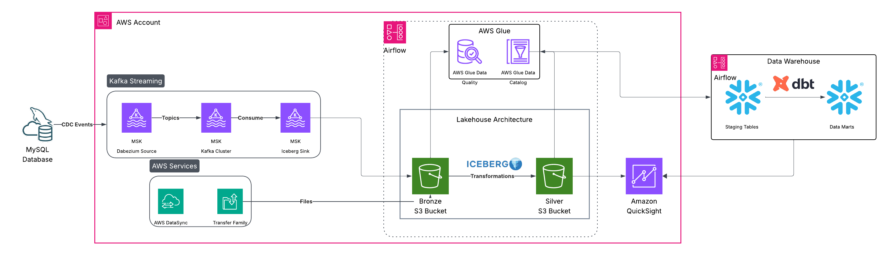

# Problem Statement

## Technical Context

The platform must support a **multi-tenant SaaS architecture** using **Medallion Architecture** (Bronze-Silver-Gold) for automated expense tracking, split calculation, and settlement reconciliation across distributed customer networks. The system processes semi-structured financial transaction data (CSV with embedded JSON) through a data lake pipeline, maintains dimension integrity via CDC from Aurora MySQL, and provides real-time analytical capabilities in Snowflake while ensuring complete tenant data isolation.

## **Functional Requirements**

| Requirement | Technical Implementation |
|-------------|-------------------------|
| **Medallion Processing** | Bronze (raw) → Silver (validated) → Gold (business) layer processing with complete lineage |
| **JSON Parsing** | AWS Glue DynamicFrame JSON parsing with error handling and schema validation |
| **CDC Integration** | Aurora MySQL CDC → S3 Bronze → Silver SCD Type 2 processing |
| **External Tables** | Snowflake external tables pointing to S3 Silver layer with auto-refresh |
| **DBT Transformations** | Incremental DBT models for fact generation with surrogate key management |
| **Tenant Isolation** | Multi-tenant data isolation across S3, Glue, and Snowflake layers |
| **Data Quality** | Automated quality scoring and monitoring across all pipeline stages |


## Architecture


**Data Platform:** **Real-time CDC** from SQL Server via **Debezium → Kafka** topics partitioned by tenant
→ S3 Bronze layer with **Apache Iceberg** for schema evolution → **AWS Glue** ETL for JSON parsing and
SCD processing → **S3 Silver/Gold layers** → **Snowflake external tables** for zero-copy analytics → **DBT
transformations** for business logic and incremental fact generation → **QuickSight dashboards** with real-
time debt tracking and settlement monitoring. **Apache Airflow** orchestrates end-to-end workflow management
with dependency resolution, SLA monitoring, and automated retry mechanisms across all pipeline stages.

**Technologies:** **Data Ingestion Streaming:** SQL Server, Debezium CDC, Apache Kafka, Apache Spark
**Data Lake Storage:** Amazon S3, Apache Iceberg table format **ETL Processing:** AWS Glue, Apache Spark, DBT
transformations **Analytics Warehousing:** Snowflake MPP, External Tables **Visualization:** Amazon QuickSight
dashboards **Orchestration DevOps:** Apache Airflow, Github Actions, CI/CD pipelines

## Data Model

```mermaid
erDiagram
    %% SOURCE SYSTEMS
    CSV_TRANSACTIONS {
        string file_name
        date transaction_date
        string narration
        string reference_number
        decimal withdrawal_amount
        decimal deposit_amount
        decimal closing_balance
        string category
        text others_involved_json
    }
    
    CSV_SETTLEMENTS {
        string file_name
        date settlement_date
        string debtor_customer_id
        string creditor_customer_id
        decimal settlement_amount
        string settlement_method_id
        string settlement_type
        string reference_transaction_ref
        string status
    }
    
    AURORA_CDC {
        string table_name
        string operation_type
        timestamp event_timestamp
        json before_image
        json after_image
    }

    %% BRONZE LAYER (S3)
    RAW_TRANSACTIONS {
        varchar transaction_id PK
        varchar tenant_id
        date transaction_date
        varchar narration
        varchar reference_number
        decimal withdrawal_amount
        decimal deposit_amount
        varchar category
        text others_involved_json
        varchar file_name
        timestamp ingestion_timestamp
        varchar source_system
        varchar processing_status
        timestamp created_at
    }
    
    RAW_SETTLEMENTS {
        varchar settlement_id PK
        varchar tenant_id
        date settlement_date
        varchar debtor_customer_id
        varchar creditor_customer_id
        decimal settlement_amount
        varchar settlement_method_id
        varchar settlement_type
        varchar reference_transaction_ref
        varchar status
        varchar file_name
        timestamp ingestion_timestamp
        varchar source_system
        varchar record_hash
        varchar processing_status
        timestamp created_at
    }
    
    RAW_DIM_CUSTOMERS {
        bigint customer_sk PK
        varchar customer_id UK
        varchar customer_name
        varchar customer_type
        varchar tenant_id
        date registration_date
        varchar status
        varchar cdc_operation
        timestamp cdc_timestamp
        varchar record_hash
        varchar processing_status
        timestamp created_at
    }
    
    RAW_DIM_ACCOUNTS {
        bigint account_sk PK
        varchar account_number UK
        bigint customer_sk FK
        varchar tenant_id
        varchar account_type
        varchar currency_code
        date opened_date
        varchar status
        varchar cdc_operation
        timestamp cdc_timestamp
        varchar record_hash
        varchar processing_status
        timestamp created_at
    }
    
    RAW_DIM_VENDORS {
        bigint vendor_sk PK
        varchar vendor_id UK
        varchar vendor_name
        varchar vendor_category
        varchar mcc_code
        varchar tenant_id
        varchar cdc_operation
        timestamp cdc_timestamp
        varchar record_hash
        varchar processing_status
        timestamp created_at
    }
    
    RAW_DIM_CATEGORIES {
        bigint category_sk PK
        varchar category_id UK
        varchar category_name
        bigint parent_category_sk FK
        int category_level
        boolean is_shared_expense
        varchar tenant_id
        varchar cdc_operation
        timestamp cdc_timestamp
        varchar record_hash
        varchar processing_status
        timestamp created_at
    }
    
    RAW_DIM_SETTLEMENT_METHODS {
        bigint method_sk PK
        varchar method_id UK
        varchar method_name
        varchar method_type
        boolean is_active
        varchar cdc_operation
        timestamp cdc_timestamp
        varchar record_hash
        varchar processing_status
        timestamp created_at
    }

    %% SILVER LAYER (S3)
    SILVER_TRANSACTIONS_CLEANED {
        varchar transaction_id PK
        varchar tenant_id
        date transaction_date
        varchar narration
        varchar reference_number
        decimal withdrawal_amount
        decimal deposit_amount
        varchar category
        text others_involved_json
        varchar extracted_vendor_name
        decimal data_quality_score
        boolean is_valid
        varchar validation_errors
        timestamp processed_at
        timestamp created_at
    }
    
    SILVER_DIMENSIONS_CLEANED {
        varchar table_name
        varchar primary_key
        json cleaned_record
        decimal data_quality_score
        boolean is_valid
        varchar validation_errors
        timestamp processed_at
        timestamp created_at
    }
    
    SILVER_ALLOCATIONS_NORMALIZED {
        varchar allocation_id PK
        varchar transaction_id FK
        varchar tenant_id
        varchar payer_customer_id
        varchar beneficiary_customer_id
        decimal allocated_amount
        decimal allocation_percentage
        varchar allocation_type
        varchar allocation_note
        varchar split_group_id
        timestamp processed_at
        timestamp created_at
    }
    
    SILVER_SETTLEMENTS_CLEANED {
        varchar settlement_id PK
        varchar tenant_id
        date settlement_date
        varchar debtor_customer_id
        varchar creditor_customer_id
        decimal settlement_amount
        varchar settlement_method_id
        varchar settlement_type
        varchar reference_transaction_ref
        varchar status
        decimal data_quality_score
        boolean is_valid
        varchar validation_errors
        timestamp processed_at
        timestamp created_at
    }
    
    SILVER_DIMENSIONS_SCD {
        varchar table_name
        varchar natural_key
        json current_record
        date effective_date
        date end_date
        boolean is_current
        int version_number
        varchar change_type
        timestamp processed_at
        timestamp created_at
    }

    %% SNOWFLAKE EXTERNAL TABLES (S3 Silver Layer Access)
    EXT_SILVER_TRANSACTIONS {
        varchar transaction_id PK
        varchar tenant_id
        date transaction_date
        varchar narration
        varchar reference_number
        decimal withdrawal_amount
        decimal deposit_amount
        varchar category
        variant others_involved_json
        varchar extracted_vendor_name
        decimal data_quality_score
        boolean is_valid
        varchar validation_errors
        timestamp processed_at
        timestamp created_at
        string s3_file_path
        timestamp s3_file_modified
    }
    
    EXT_SILVER_ALLOCATIONS {
        varchar allocation_id PK
        varchar transaction_id FK
        varchar tenant_id
        varchar payer_customer_id
        varchar beneficiary_customer_id
        decimal allocated_amount
        decimal allocation_percentage
        varchar allocation_type
        varchar allocation_note
        varchar split_group_id
        timestamp processed_at
        timestamp created_at
        string s3_file_path
        timestamp s3_file_modified
    }
    
    EXT_SILVER_SETTLEMENTS {
        varchar settlement_id PK
        varchar tenant_id
        date settlement_date
        varchar debtor_customer_id
        varchar creditor_customer_id
        decimal settlement_amount
        varchar settlement_method_id
        varchar settlement_type
        varchar reference_transaction_ref
        varchar status
        decimal data_quality_score
        boolean is_valid
        varchar validation_errors
        timestamp processed_at
        timestamp created_at
        string s3_file_path
        timestamp s3_file_modified
    }
    
    EXT_SILVER_DIM_CUSTOMERS {
        bigint customer_sk PK
        varchar customer_id UK
        varchar customer_name
        varchar customer_type
        varchar tenant_id
        date registration_date
        varchar status
        date effective_date
        date end_date
        boolean is_current
        int version_number
        timestamp created_at
        string s3_file_path
        timestamp s3_file_modified
    }
    
    EXT_SILVER_DIM_ACCOUNTS {
        bigint account_sk PK
        varchar account_number UK
        bigint customer_sk FK
        varchar tenant_id
        varchar account_type
        varchar currency_code
        date opened_date
        varchar status
        date effective_date
        date end_date
        boolean is_current
        int version_number
        timestamp created_at
        string s3_file_path
        timestamp s3_file_modified
    }
    
    EXT_SILVER_DIM_VENDORS {
        bigint vendor_sk PK
        varchar vendor_id UK
        varchar vendor_name
        varchar vendor_category
        varchar mcc_code
        varchar tenant_id
        date effective_date
        date end_date
        boolean is_current
        int version_number
        timestamp created_at
        string s3_file_path
        timestamp s3_file_modified
    }
    
    EXT_SILVER_DIM_CATEGORIES {
        bigint category_sk PK
        varchar category_id UK
        varchar category_name
        bigint parent_category_sk FK
        int category_level
        boolean is_shared_expense
        varchar tenant_id
        date effective_date
        date end_date
        boolean is_current
        int version_number
        timestamp created_at
        string s3_file_path
        timestamp s3_file_modified
    }
    
    EXT_SILVER_DIM_SETTLEMENT_METHODS {
        bigint method_sk PK
        varchar method_id UK
        varchar method_name
        varchar method_type
        boolean is_active
        date effective_date
        date end_date
        boolean is_current
        int version_number
        timestamp created_at
        string s3_file_path
        timestamp s3_file_modified
    }

    %% SNOWFLAKE GOLD LAYER (dbt Output)
    GOLD_FACT_TRANSACTIONS {
        bigint transaction_sk PK
        varchar transaction_id UK
        varchar tenant_id
        timestamp transaction_date
        bigint account_sk FK
        bigint payer_customer_sk FK
        bigint vendor_sk FK
        bigint category_sk FK
        decimal transaction_amount
        varchar currency_code
        varchar transaction_type
        varchar channel
        text description
        varchar reference_number
        timestamp dbt_processed_at
        timestamp created_at
    }
    
    GOLD_FACT_EXPENSE_ALLOCATIONS {
        bigint allocation_sk PK
        varchar tenant_id
        bigint transaction_sk FK
        bigint payer_customer_sk FK
        bigint beneficiary_customer_sk FK
        decimal allocated_amount
        decimal allocation_percentage
        varchar allocation_type
        varchar allocation_note
        varchar settlement_status
        decimal settled_amount
        varchar split_group_id
        timestamp dbt_processed_at
        timestamp created_at
    }
    
    GOLD_FACT_SETTLEMENTS {
        bigint settlement_sk PK
        varchar settlement_id UK
        varchar tenant_id
        timestamp settlement_date
        bigint debtor_customer_sk FK
        bigint creditor_customer_sk FK
        decimal settlement_amount
        bigint settlement_method_sk FK
        bigint original_allocation_sk FK
        varchar settlement_type
        varchar reference_transaction_ref
        varchar status
        timestamp dbt_processed_at
        timestamp created_at
    }
    
    GOLD_FACT_LEDGER {
        bigint ledger_sk PK
        varchar ledger_entry_id UK
        varchar tenant_id
        bigint transaction_sk FK
        timestamp ledger_date
        bigint account_sk FK
        bigint customer_sk FK
        decimal debit_amount
        decimal credit_amount
        decimal running_balance
        varchar entry_type
        varchar reference_id
        text description
        timestamp posted_timestamp
        timestamp dbt_processed_at
        timestamp created_at
    }

    %% MONITORING TABLES
    MONITORING_DATA_QUALITY_METRICS {
        varchar metric_id PK
        varchar table_name
        varchar layer_name
        bigint record_count
        decimal data_quality_score
        varchar quality_issues
        timestamp measurement_timestamp
        varchar job_run_id
        timestamp created_at
    }
    
    MONITORING_JOB_LINEAGE {
        varchar lineage_id PK
        varchar source_table
        varchar target_table
        varchar job_name
        varchar transformation_type
        timestamp job_start_time
        timestamp job_end_time
        varchar job_status
        bigint records_processed
        varchar error_message
        timestamp created_at
    }

    %% DATA FLOW RELATIONSHIPS
    CSV_TRANSACTIONS ||--o{ RAW_TRANSACTIONS : "GLUE_bronze_ingestion"
    CSV_SETTLEMENTS ||--o{ RAW_SETTLEMENTS : "GLUE_bronze_ingestion"
    AURORA_CDC ||--o{ RAW_DIM_CUSTOMERS : "GLUE_cdc_ingestion"
    AURORA_CDC ||--o{ RAW_DIM_ACCOUNTS : "GLUE_cdc_ingestion"
    AURORA_CDC ||--o{ RAW_DIM_VENDORS : "GLUE_cdc_ingestion"
    AURORA_CDC ||--o{ RAW_DIM_CATEGORIES : "GLUE_cdc_ingestion"
    AURORA_CDC ||--o{ RAW_DIM_SETTLEMENT_METHODS : "GLUE_cdc_ingestion"
    
    RAW_TRANSACTIONS ||--o{ SILVER_TRANSACTIONS_CLEANED : "GLUE_silver_validation"
    RAW_SETTLEMENTS ||--o{ SILVER_SETTLEMENTS_CLEANED : "GLUE_silver_validation"
    RAW_DIM_CUSTOMERS ||--o{ SILVER_DIMENSIONS_CLEANED : "GLUE_silver_validation"
    RAW_DIM_ACCOUNTS ||--o{ SILVER_DIMENSIONS_CLEANED : "GLUE_silver_validation"
    RAW_DIM_VENDORS ||--o{ SILVER_DIMENSIONS_CLEANED : "GLUE_silver_validation"
    RAW_DIM_CATEGORIES ||--o{ SILVER_DIMENSIONS_CLEANED : "GLUE_silver_validation"
    RAW_DIM_SETTLEMENT_METHODS ||--o{ SILVER_DIMENSIONS_CLEANED : "GLUE_silver_validation"
    
    SILVER_TRANSACTIONS_CLEANED ||--o{ SILVER_ALLOCATIONS_NORMALIZED : "GLUE_json_parsing"
    SILVER_DIMENSIONS_CLEANED ||--o{ SILVER_DIMENSIONS_SCD : "GLUE_scd_processing"
    
    SILVER_TRANSACTIONS_CLEANED ||--o{ EXT_SILVER_TRANSACTIONS : "SNOWFLAKE_external_table"
    SILVER_ALLOCATIONS_NORMALIZED ||--o{ EXT_SILVER_ALLOCATIONS : "SNOWFLAKE_external_table"
    SILVER_SETTLEMENTS_CLEANED ||--o{ EXT_SILVER_SETTLEMENTS : "SNOWFLAKE_external_table"
    SILVER_DIMENSIONS_SCD ||--o{ EXT_SILVER_DIM_CUSTOMERS : "SNOWFLAKE_external_table"
    SILVER_DIMENSIONS_SCD ||--o{ EXT_SILVER_DIM_ACCOUNTS : "SNOWFLAKE_external_table"
    SILVER_DIMENSIONS_SCD ||--o{ EXT_SILVER_DIM_VENDORS : "SNOWFLAKE_external_table"
    SILVER_DIMENSIONS_SCD ||--o{ EXT_SILVER_DIM_CATEGORIES : "SNOWFLAKE_external_table"
    SILVER_DIMENSIONS_SCD ||--o{ EXT_SILVER_DIM_SETTLEMENT_METHODS : "SNOWFLAKE_external_table"
    
    EXT_SILVER_TRANSACTIONS ||--o{ GOLD_FACT_TRANSACTIONS : "DBT_transformation"
    EXT_SILVER_ALLOCATIONS ||--o{ GOLD_FACT_EXPENSE_ALLOCATIONS : "DBT_transformation"
    EXT_SILVER_SETTLEMENTS ||--o{ GOLD_FACT_SETTLEMENTS : "DBT_transformation"
    EXT_SILVER_DIM_CUSTOMERS ||--o{ GOLD_FACT_TRANSACTIONS : "DBT_dimension_lookup"
    EXT_SILVER_DIM_ACCOUNTS ||--o{ GOLD_FACT_TRANSACTIONS : "DBT_dimension_lookup"
    EXT_SILVER_DIM_VENDORS ||--o{ GOLD_FACT_TRANSACTIONS : "DBT_dimension_lookup"
    EXT_SILVER_DIM_CATEGORIES ||--o{ GOLD_FACT_TRANSACTIONS : "DBT_dimension_lookup"
    EXT_SILVER_DIM_SETTLEMENT_METHODS ||--o{ GOLD_FACT_SETTLEMENTS : "DBT_dimension_lookup"
    
    GOLD_FACT_TRANSACTIONS ||--o{ GOLD_FACT_LEDGER : "DBT_ledger_generation"
    GOLD_FACT_SETTLEMENTS ||--o{ GOLD_FACT_EXPENSE_ALLOCATIONS : "DBT_settlement_resolution"
    EXT_SILVER_SETTLEMENTS ||--o{ GOLD_FACT_EXPENSE_ALLOCATIONS : "DBT_update_settled_amounts"
```



### **Fact Table Grain & Relationships**

| **Fact Table** | **Grain** | **Relationship Pattern** | **Cardinality Impact** |
|----------------|-----------|-------------------------|------------------------|
| **FACT_TRANSACTIONS** | 1 record per bank transaction | Standard star schema | 1:Many with dimensions |
| **FACT_EXPENSE_ALLOCATIONS** | 1 record per participant per transaction | **Bridge table pattern** | **Cardinality explosion** (1→N) |
| **FACT_SETTLEMENTS** | 1 record per settlement | **Accumulating snapshot** | Many:1 to allocations |
| **FACT_LEDGER** | 1 record per debit/credit entry | Double-entry bookkeeping | N+1 entries per transaction |

---

## 🔗 Advanced Relationship Patterns

### **1. Bridge Table Implementation**
```
FACT_EXPENSE_ALLOCATIONS resolves Many-to-Many:
Transaction (1) ←→ (Many) Customer
├── JSON Parsing: 1 transaction → 2-50 allocation records
├── Role-Playing Dimension: Customer as Payer/Beneficiary
├── Weighting Factor: allocation_percentage (business rule: sum ≤ 100%)
└── Cross-Reference: Enables debt network analysis
```

### **2. Self-Referencing Hierarchy**
```
DIM_CATEGORIES: parent_category_sk → category_sk
├── Hierarchy Depth: 3-4 levels (Root → Sub → Detail)
├── Recursive Queries: Category drill-down analysis
└── Tenant Isolation: Each tenant maintains separate hierarchies
```

### **3. Role-Playing Dimensions**
```
DIM_CUSTOMERS serves multiple roles:
├── FACT_TRANSACTIONS: payer_customer_sk
├── FACT_ALLOCATIONS: payer_customer_sk, beneficiary_customer_sk  
├── FACT_SETTLEMENTS: debtor_customer_sk, creditor_customer_sk
└── Query Impact: Same dimension joined multiple times
```

### **4. SCD Type 2 Relationships**
```
Dimension Versioning:
├── Fields: effective_date, end_date, is_current, version_number
├── Fact Relationship: Facts link to historical dimension versions
├── Query Complexity: Point-in-time joins with date range filters
└── Business Value: Historical accuracy for regulatory reporting
```

---


